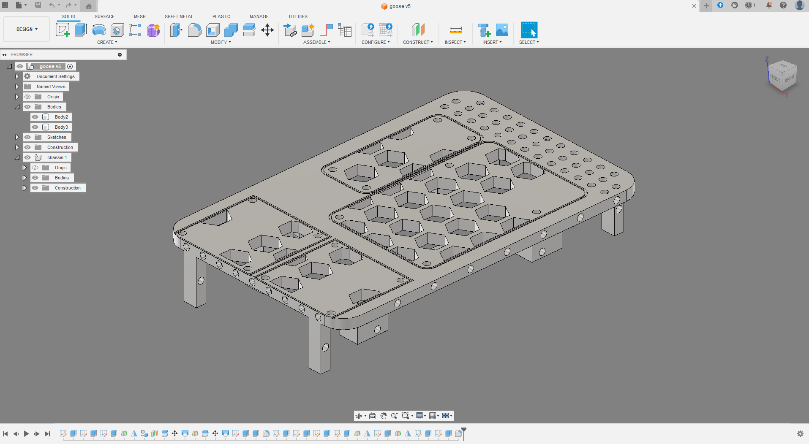
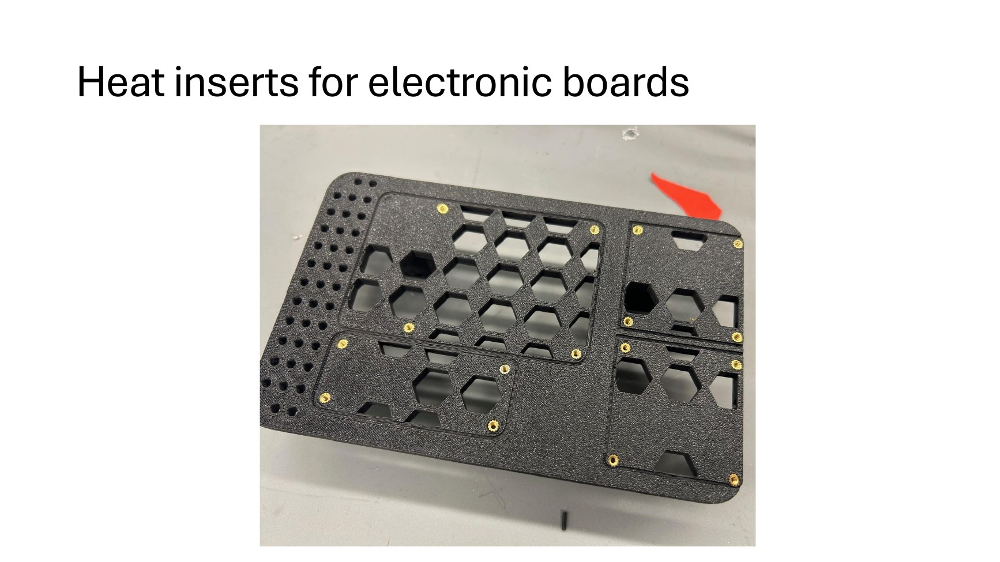
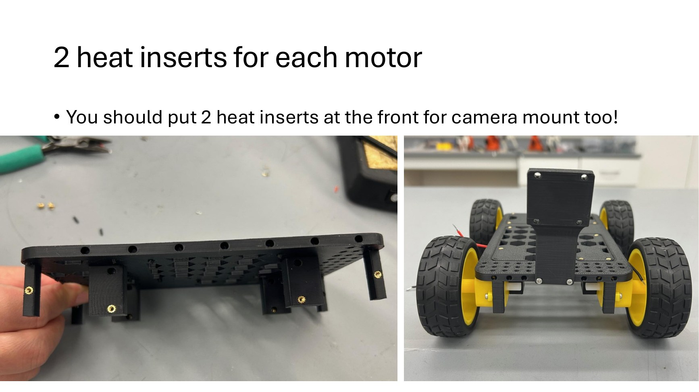
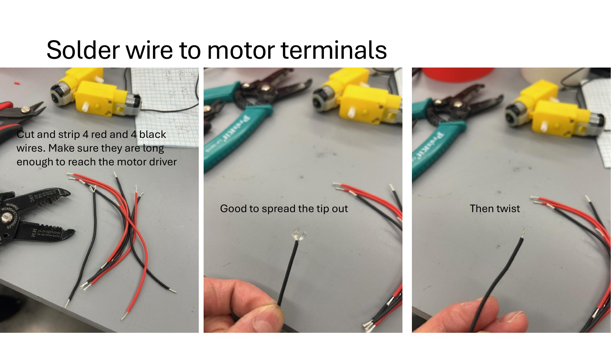
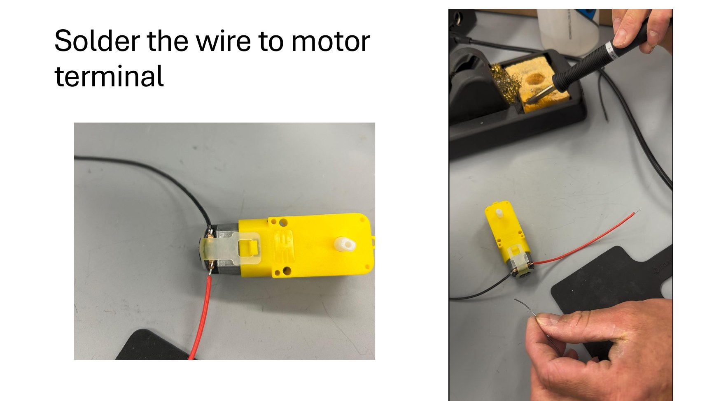
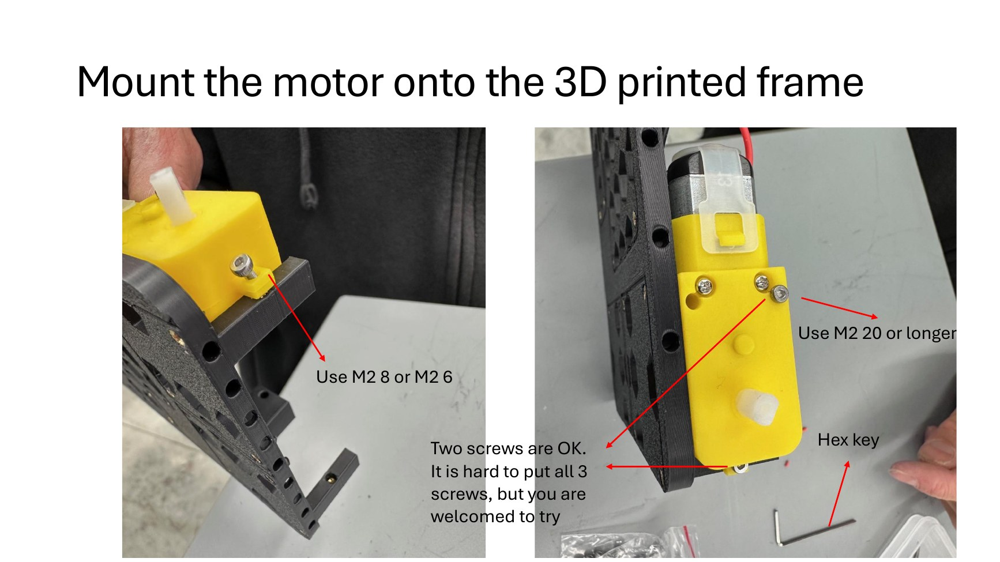
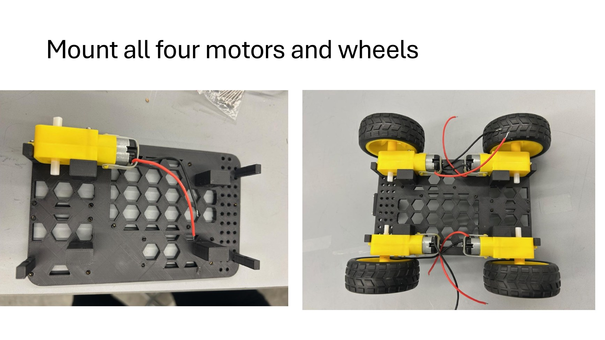
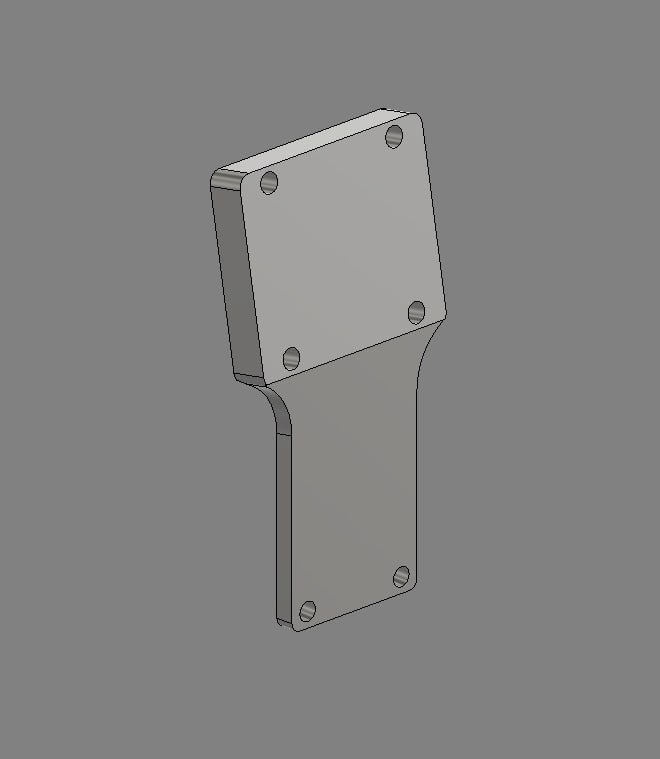

# Activity 02 - Assemble the GooseBot Chassis

## Mission

Prepare the printed chassis, install heat-set inserts, mount all four motors and wheels, and install the camera mount without damaging the printed parts or electronics.

## Why It Matters

Mechanical alignment affects autonomous driving. Loose motors change the wheel geometry, poorly routed wires reach the tires, and a flexible camera mount changes the perceived lane position. A serviceable chassis also allows electronics to be removed without wearing out plastic threads.

## Success Criteria

- Required inserts sit flush and do not spin.
- Four motors are secure, with wheels rotating freely and no wire rubbing.
- The camera mount is secure and adjustable.
- Electronics can be placed over their recessed outlines without interference.
- No sharp conductor, loose fastener, or unsupported cable can reach a wheel.

## Prerequisites and Materials

- Complete [Activity 01](../01_hardware_selection/README.md).
- Printed GooseBot chassis and camera mount.
- M2 heat-set inserts and appropriate M2 screws.
- Four motors and wheels.
- Soldering iron, solder, wire cutters, wire stripper, heat-resistant work surface, and eye protection.
- Red and black stranded motor wire long enough to reach the appropriate driver.

CAD source files are provided in this directory:

- [`goose chassis v5.step`](goose%20chassis%20v5.step) and [`goose chassis v5.f3d`](goose%20chassis%20v5.f3d)
- [`Camera Mount - Goose.step`](Camera%20Mount%20-%20Goose.step) and [`Camera Mount - Goose.f3d`](Camera%20Mount%20-%20Goose.f3d)

The chassis has been printed successfully in ASA. ABS or PLA may also work when print settings and expected temperature are appropriate.

## Safety Gate

- Wear eye protection and use the soldering iron only at a designated soldering station.
- Assume the iron, insert, and nearby plastic remain hot after contact.
- Ventilate soldering work and wash hands afterward.
- Keep every battery and power supply disconnected throughout this activity.
- Clamp or support the work; never hold a small hot insert with bare fingers.

## Part 1 - Inspect the Printed Parts

1. Remove support material and loose strings without enlarging the mounting holes.
2. Test-fit, but do not force, the motors, camera mount, and electronic boards.
3. Identify the front of the chassis. The camera will face forward.
4. Check the chassis for cracks or warped areas that would prevent a motor from sitting flat.

## Part 2 - Install Heat-Set Inserts

1. Identify the required holes before heating the iron. At minimum, prepare the motor mounts, front camera-mount holes, and the board positions your build will use.
2. Place an insert squarely over a hole.
3. Press it slowly with the hot iron until it is flush. Do not push through the chassis.
4. Hold the iron vertical, withdraw it straight upward, and let the insert cool before testing it.
5. Install two well-aligned inserts for each motor. The design allows additional fasteners, but two secure fasteners are sufficient for the reference build.
6. Install the two front inserts for the camera mount before electronics obstruct access.

## Part 3 - Prepare the Motor Wires

1. Cut four red and four black wires. Leave enough length to reach the left or right L298N board after routing through the chassis.
2. Strip and twist each end. Lightly tin the motor-terminal end.
3. Tin each motor terminal, then solder red and black leads without overheating the plastic gearbox.
4. Inspect for stray strands and accidental bridges.
5. Label the motors `FL`, `FR`, `RL`, and `RR` for front-left, front-right, rear-left, and rear-right.

## Part 4 - Mount the Motors and Wheels

1. Position each motor so its gearbox and terminals do not interfere with the frame.
2. Use appropriate M2 screws. In the reference assembly, short M2 screws retain the motor body and a longer screw can pass through the outer support.
3. Tighten until secure; do not crush the gearbox or strip the insert.
4. Install each wheel and spin it by hand.
5. Route wires inward through chassis openings, away from wheel edges.

## Part 5 - Install the Camera Mount

1. Attach the mount to the front inserts with M2 screws.
2. Install the de-housed camera module using inserts or nuts as appropriate for the camera.
3. Leave enough adjustment to aim the camera down the road while keeping cables clear of the wheels.
4. Do not permanently set the viewing angle yet; Activity 09 includes final camera-angle tuning.

## Command Breakdown

No terminal commands are required. The `.step` files are neutral CAD exchange files; the `.f3d` files preserve editable Autodesk Fusion design information. Students normally print the provided design rather than modifying it.

## Completion Checklist

- [ ] inserts are flush, cool, and secure
- [ ] all four motor labels are visible
- [ ] wheels rotate without rubbing
- [ ] camera mount is secure
- [ ] motor and camera wires cannot contact a tire
- [ ] no power has been applied yet

## What to Submit

Unless Canvas says otherwise, submit:

- one top-view and one bottom-view photograph of the assembled chassis;
- one close-up showing secure motor and camera-mount inserts; and
- a brief description of each group member's contribution.

## Troubleshooting

| Problem | Check |
|---|---|
| insert enters at an angle | stop, reheat gently, and straighten before it cools; do not enlarge the hole by force |
| screw does not align | loosen neighboring screws, align all fasteners by hand, then tighten gradually |
| wheel rubs the chassis | reseat the wheel and motor, inspect print warping, and verify motor orientation |
| solder joint moves or looks dull | disconnect everything, reflow the joint, and inspect for stray strands |
| camera cable can reach a wheel | reroute it and add strain relief before proceeding |

## Next Activity

Continue to [Activity 03 - Mounting, Wiring, and Benchtop Tests](../03_mounting_and_wiring/README.md).
