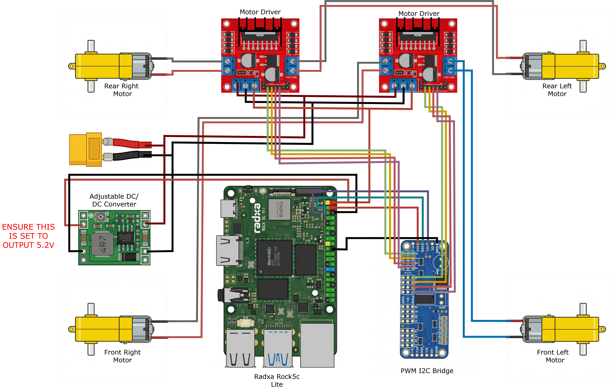
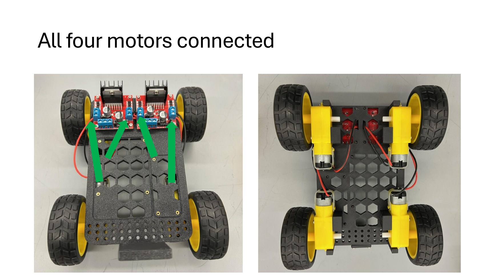
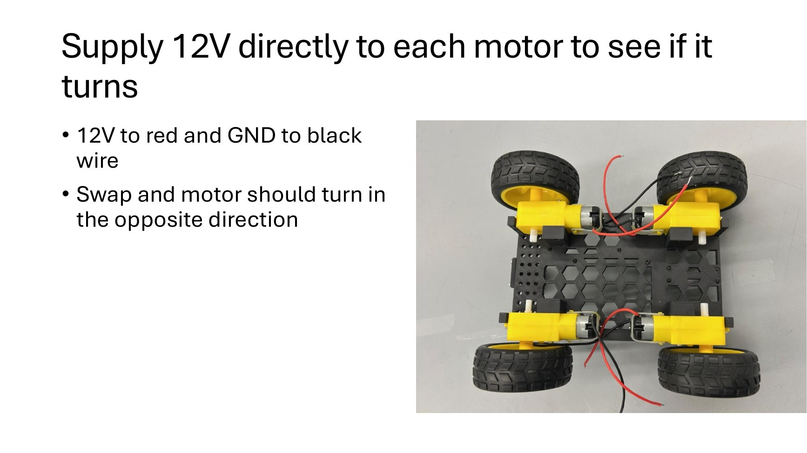
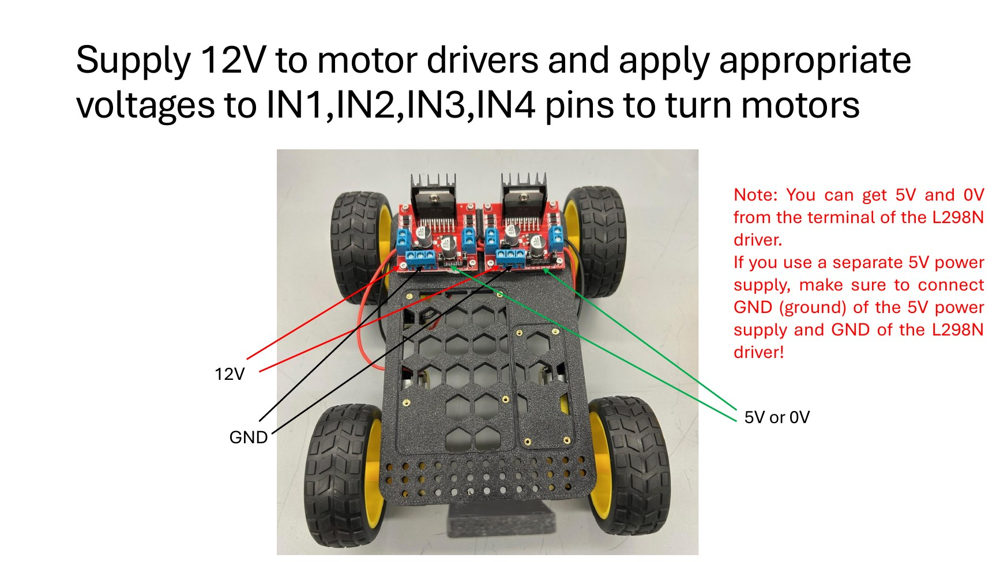
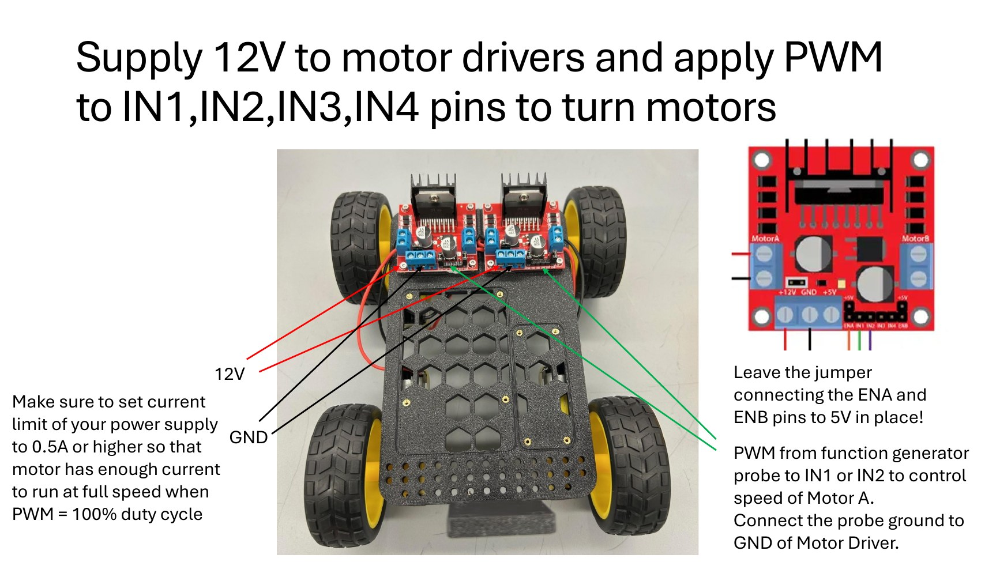
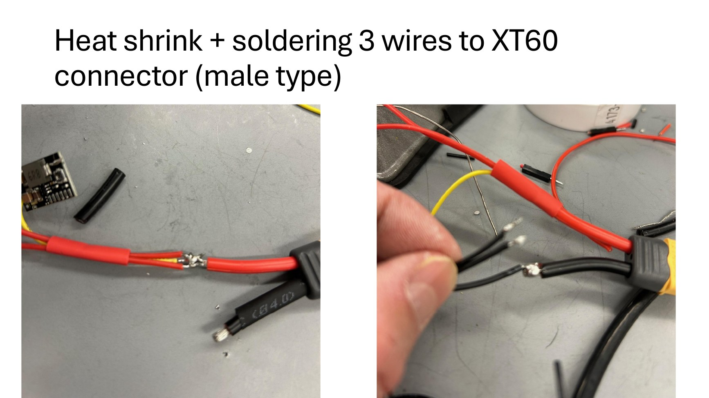
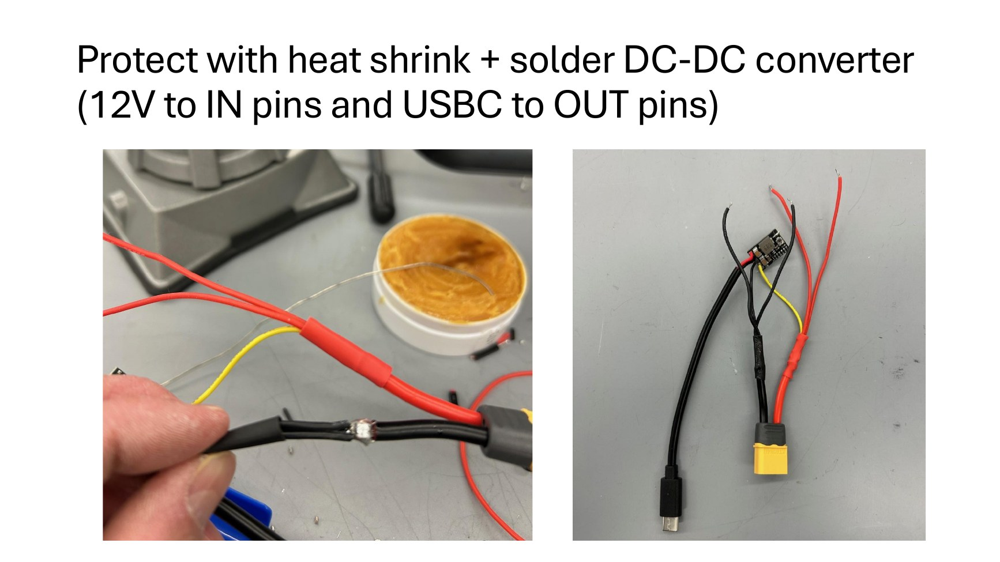
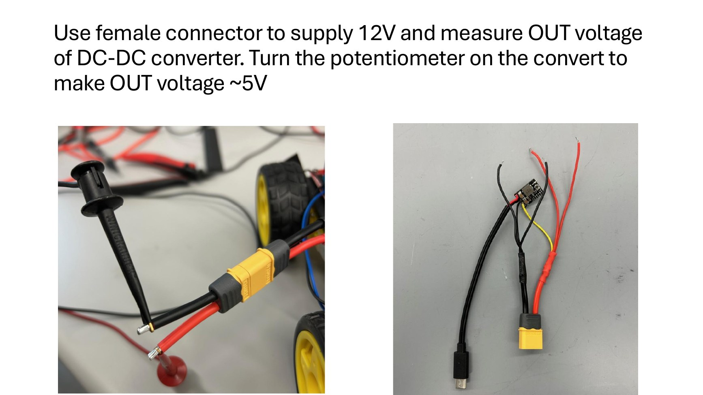
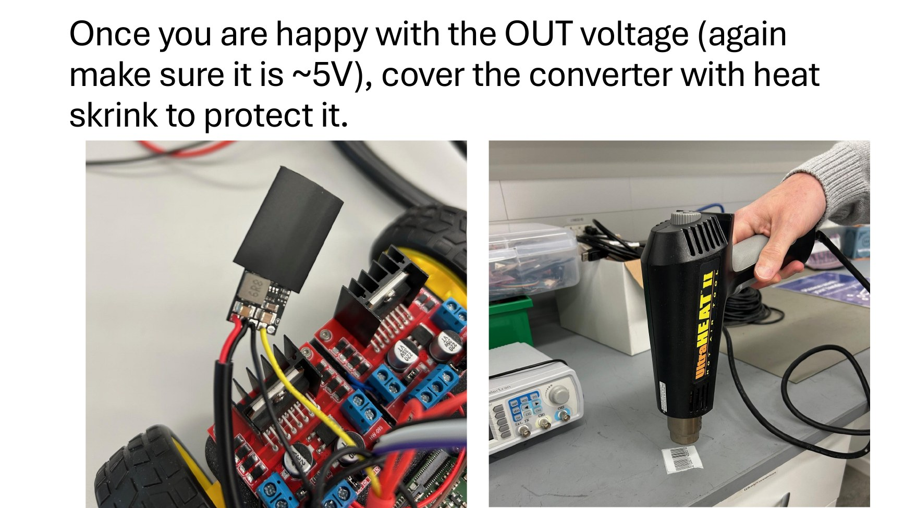

# Activity 03 - Mount, Wire, and Test the Drive Hardware

## Mission

Mount the two L298N motor drivers, connect all four motors, verify direction with static logic levels, and demonstrate PWM speed control from a function generator before connecting the ROCK 5C.

## Why It Matters

This activity separates electrical and mechanical problems from software problems. If every motor responds correctly to a known benchtop signal, later PCA9685 and Python tests start from verified hardware. It also establishes the common-ground and voltage-regulation practices needed to protect the computer.

## Success Criteria

- Left motors connect to one L298N and right motors to the other.
- Each motor can turn in both directions using the appropriate input pair.
- PWM duty cycle changes motor speed.
- All signal sources share a reference ground.
- The DC-DC converter is adjusted to approximately 5 V before it is allowed near the ROCK 5C.

## Prerequisites and Materials

- Completed [Activity 02 chassis](../02_chassis_design/README.md).
- Two L298N boards, PCA9685 board, wiring diagram, multimeter, current-limited bench supply, and function generator.
- Instructor-supervised soldering tools and power-harness components if the battery harness will be assembled.

## Safety Gate

1. Place the robot on a stand so all wheels are clear.
2. Set the bench supply output **off** before wiring.
3. Start with a conservative current limit and raise it only as directed by the instructor.
4. Never change motor or driver wiring while energized.
5. Connect function-generator ground to driver ground before applying its signal.
6. Leave the L298N `ENA` and `ENB` jumpers installed for the input-PWM test described here.
7. Do not connect the ROCK 5C in this activity.

## Part 1 - Mount and Wire the Motor Drivers

1. Install the required chassis inserts and mount one L298N on the left and one on the right.
2. Connect the front-left and rear-left motors to the two output pairs of the left driver.
3. Connect the front-right and rear-right motors to the two output pairs of the right driver.
4. Route and secure wires so they cannot enter a wheel.
5. Connect both driver grounds together. All future control boards must share this signal reference.

## Part 2 - Verify Each Bare Motor

With instructor approval, briefly apply the rated motor-test voltage directly to one motor at a time. Reverse the two leads and confirm the direction reverses. Do not stall a wheel or hold power on longer than needed for identification.

Record the result:

| Motor | Lead polarity that turns the wheel forward | Pass? |
|---|---|---|
| Front left | | |
| Rear left | | |
| Front right | | |
| Rear right | | |

"Forward" means the robot would move camera-first if all four wheels used that direction.

## Part 3 - Test Direction Through the L298N

For each motor input pair, keep one input low and set the other high. Then swap the levels.

| Input 1 | Input 2 | Expected motor state |
|---:|---:|---|
| 0 | 0 | coast/stop |
| 1 | 0 | one direction |
| 0 | 1 | opposite direction |
| 1 | 1 | brake/stop behavior depends on the board |

Use logic levels appropriate for the board. Do not connect an unknown voltage to a signal input.

## Part 4 - Test PWM Speed Control

1. Keep one input of a motor pair at ground.
2. Connect the function-generator signal to the other input and its ground to L298N ground.
3. Use a logic-level square wave. Begin at 0% duty cycle and a moderate frequency approved by the instructor.
4. Increase duty cycle gradually and observe speed.
5. Repeat for all four motors, switching power off before moving the probe.
6. Confirm that reversing which input receives PWM reverses the motor direction.

A reference demonstration is available at [YouTube](https://youtu.be/gxDH4S-0ozU).

## Part 5 - Prepare the Power Harness

Complete this part only under instructor supervision.

1. Solder the required branch wires to the male XT60 connector and protect every joint with heat-shrink.
2. Connect battery/motor voltage only to the **input** side of the buck converter. Observe polarity.
3. With the converter output disconnected from the ROCK 5C, energize the input and measure the output with a multimeter.
4. Adjust the potentiometer until the output is approximately 5 V.
5. Switch power off, verify the reading falls, re-energize, and verify the 5 V setting again.
6. Insulate the converter without creating an electrical short or blocking necessary heat dissipation.
7. Label the input, output, positive, and ground conductors.

**Critical:** never connect the ROCK 5C until the output polarity and approximately 5 V level have been measured at the actual USB-C/power connector.

## Command Breakdown

No shell command is required. In this activity, the important control terms are:

| Term | Meaning |
|---|---|
| PWM frequency | number of square-wave cycles per second |
| duty cycle | fraction of each cycle for which the signal is high |
| common ground | shared zero-volt reference used to interpret control signals |
| H-bridge | switching circuit that applies either polarity across a DC motor |
| current limit | maximum current the bench supply will deliver before reducing voltage |

## What to Submit

Unless Canvas says otherwise, submit one narrated group video that shows:

- the robot safely lifted with all four wheels clear;
- the wiring and shared ground;
- each of the four motors responding;
- at least two PWM duty cycles that visibly produce different speeds; and
- each group member's contribution.

Do not demonstrate by holding a powered robot in your hands.

## Troubleshooting

| Problem | Check |
|---|---|
| motor never turns | output power off, current limit too low, enable jumper missing, loose terminal, wrong output pair, or damaged motor |
| motor turns only one direction | inspect both input wires and test each input independently |
| PWM has no effect | verify square-wave output, amplitude, duty cycle, probe ground, and selected input |
| bench supply immediately current-limits | power off and inspect for shorts or reversed wiring |
| left/right direction differs | record it now; Activity 04 maps software direction per motor |
| converter cannot reach 5 V | confirm input/output sides and adjustment direction; disconnect it and ask the instructor |

## Next Activity

Continue to [Activity 04 - ROCK 5C Motor Mapping and Keyboard Control](../04_motor_test/README.md).
