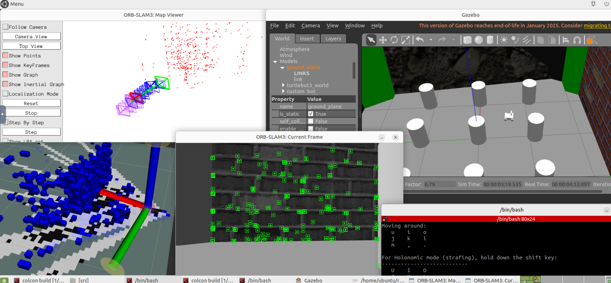

# 11_nav2 — ROS2 Nav2 simulation environment

A containerized ROS2 Humble + Nav2 + Gazebo + SLAM toolbox environment,
accessed through your browser. Works the same on Windows and Linux, no
manual ROS2 install needed on your host machine.

Note: The clipboard does not work when trying to paste something from your main computer into the container. It does work the other way around.
To save time when typing scripts, you can copy common lines from ~/ros2_ws/src/commands.txt

## 1. Install Docker Desktop

Download from [the Docker Desktop website](https://www.docker.com/products/docker-desktop/)
and run the installer with the default settings. Docker Desktop handles WSL2 internally.

After install, Docker Desktop runs in the background (check your system
tray / menu bar for its icon). Leave it running whenever you use this repo.

Make or edit a file in C:/User/\[user]/.wslconfig:

```
[wsl2]
memory=8GB
processors=8
swap=4GB
```

Set the memory to a comfortable value, as the docker building is a hungry process. The lower it goes the longer it will take the first time.
Once you're running simulations, you're going to need a lot of processors as well.

## 2. Get the repo and the right branch

```bash
git clone https://github.com/hoanbklucky/goose
cd C:/Users/[user]/goose
git checkout nav2
```

## 3. Build and run the container

From inside the repo, in a terminal (PowerShell, Git Bash, or a Linux
terminal all work the same for this):

```bash
cd 11_nav2
docker compose up --build
```

First run will take a while, likely 30 minutes or more, since it's downloading the base image and
installing ROS2/Nav2/Gazebo/TurtleBot3/OrbSLAM3/Pangolin packages. Subsequent runs without
`--build` are fast, since Docker caches what hasn't changed.

Note: expect a long pause the first time running while installing Optimizer.cc. This file alone can take up to 10 minutes.

Leave this terminal running — it's the container's live process. Closing
it (or `Ctrl+C`) stops the container.

## 4. Open the environment in your browser

Go to **http://localhost:6080**. You should see a full Ubuntu desktop
running inside the container — this is a live desktop being streamed to
your browser (via VNC/noVNC), not a webpage.

If it doesn't load: click the container in Docker Desktop's **Containers**
tab and check the **Logs** tab for errors.

From here, you should be able to skip to section 9 if everything is set up correctly.

## 5. Open a terminal inside that browser desktop

There's a terminal app icon on the virtual desktop. Use it to confirm the
environment is set up correctly:

```bash
printenv ROS_DISTRO           # should print "humble"
ros2 pkg list | grep nav2     # should list several nav2_* packages
ros2 pkg list | grep turtlebot3
```

## 6. Run the TurtleBot3 Gazebo simulation

TurtleBot3 is the default robot + world Nav2's own tutorials use, so it's
the quickest way to confirm the whole sim pipeline actually works
end-to-end before building anything custom on top of it.

In the container's terminal:
```bash
export TURTLEBOT3_MODEL=waffle
source /opt/ros/humble/setup.bash
ros2 launch turtlebot3_gazebo turtlebot3_world.launch.py
```

Give it a minute on first launch — Gazebo is slow to open, and this
container runs on software rendering rather than GPU acceleration (see
note below), so expect it to feel a bit slower than a native install.

## 7. Drive turtlebot3

Open a **second terminal** inside the browser desktop (leave the Gazebo
one running):
```bash
export TURTLEBOT3_MODEL=waffle
ros2 run turtlebot3_teleop teleop_keyboard
```
Click into that terminal window first so it has keyboard focus, then use
the keys it prints on screen to drive.

If this all works, add the model export to your shell profile:
```bash
echo 'export TURTLEBOT3_MODEL=waffle' >> ~/.bashrc
```

## 8. Shut down when you're done

Outside the container in terminal:
```bash
docker compose down
```
This stops and removes the container. The built image stays cached (so
next time is fast), and nothing in your mounted workspace files is
affected — those only ever live on your actual host disk.

## Notes and known limitations

- **Copy/paste into the browser desktop is limited.** noVNC has its own
  clipboard, separate from your OS clipboard. Look for a small tab on the
  edge of the browser window — it opens a sidebar with a clipboard text
  box you paste into first. For any real editing, skip this entirely and
  edit files on your host machine instead (see below) — it's much less
  friction.
- **Edit code on your host, not inside the browser desktop.** Your repo's
  `11_nav2/ros2_ws/src` folder is live-mounted into the container at
  `~/ros2_ws/src`. Edit with your normal editor (VSCode, etc.) on your
  actual machine; changes appear inside the container immediately, no
  rebuild needed.
- **No GPU acceleration.** This runs on software rendering by default so
  it behaves identically on Windows and Linux regardless of GPU vendor.
  Gazebo will be noticeably slower than a native, GPU-accelerated install.
- **Adding new apt packages means editing the `Dockerfile`, not just
  installing inside a running container.** Installing directly in a live
  container (`sudo apt install ...`) only affects that container instance
  — it disappears on the next `--build`. To make a package permanently
  part of the environment, add it to the `RUN apt-get install` list in
  `Dockerfile`, then run `docker compose up --build` again and commit the
  Dockerfile change.
  
## 9. Work with custom models

Custom models require a folder placed in goose/11_nav2/ros2_ws/src/
The example is named goosebot_0 with files inside including:
- **urdf/robot.urdf.xacro**: The physical shape/model of the robot
- **launch/spawn_robot.launch.py**: The command to create the robot in Gazebo
- **package.xml**: Metadata about this model and runtime dependencies for colcon
- **CMakeLists.txt**: The build/install rules for copying files into the package

Change the name in spawn_robot.launch.py, package.xml, and CMakeLists.txt 
from goosebot_0 to your model name.

Run a Gazebo environment with a custom model by opening a terminal
in the container and running:

```bash
cd ~/ros2_ws
colcon build --symlink-install
source install/setup.bash
ros2 launch goosebot_0 spawn_robot.launch.py	# Replace goosebot_0 with your model name
```

(If you don't care about running SLAM later, you can choose to only build the robot package:)

```bash
colcon build --packages-select goosebot_0		# Replace goosebot_0 with your model name
```

To control through the keyboard, run in a second terminal:

```bash
ros2 run teleop_twist_keyboard teleop_twist_keyboard
```

## 10. Simulate and process sensor data

This step is where the SLAM and Pangolin packages are necessary, which drastically increases the docker compile time.
This also includes OrbSLAM3 as a package in ros2_ws/src, which is cloned from Github with some changes. The .git file has been removed in order to allow adding to this repo.

There is already a camera included in the goosebot_0 model. After starting the Gazebo simulation, the live camera output of the robot can be seen by running this in another terminal:

```bash
ros2 run rqt_image_view rqt_image_view
```

This shows the live camera feed to make sure the camera works, but does not run SLAM. For that, you need to run the SLAM package:

```bash
cd ~/ros2_ws/src/orbslam3_ros2
source install/setup.bash
ros2 launch orbslam3_ros2 orbslam3_ros2.launch.py camera_type:=mono start_octomap:=true visualize:=true
```

If you skipped the general colcon build earlier, you'll have to run the general colcon build before sourcing:

```bash
colcon build --symlink-install
```

Running the object detection will open a window, then 2 more windows after a delay. They will all be empty by default. The frame
view window is the first one to look at- it will say "waiting for images." The robot has to look at a textured surface
in order to have the SLAM algorithm notice anything. To test this in Gazebo, insert an online model (I've found that the brick wall works best)
and drive towards and away from it. The frame window should populate with a grayscale version of what the camera sees, with some green points on it.
Looking away from this or stopping moving will stop the output. It needs to have moving, textured points to output anything.

The other two windows show the projections outwards. The Map View window projects the red dots outwards and shows the frames that the robot is viewing from.
The window that has the biggest GUI will generate the OctoMap that will be used in order to navigate with the ROS2 packages.



Camera settings can be adjusted in ~/ros2_ws/src/orbslam3_ros2/config/camera_and_slam_settings.yaml

Instead of inserting a brick wall, you can also use the custom-made brick square for testing by launching Gazebo with this command:

```bash
ros2 launch goosebot_0 spawn_robot.launch.py world:=/home/ubuntu/ros2_ws/src/brick_area.world
```

## 11. Run autonomous navigation in simulation

NEXT STEP TODO: This is what all the work is for- using the sensor data in order to navigate. Using
the ROS2 packages and input data, make a pathfinding algorithm that can navigate
on Goosebot.

Currently, I have been playing around with a simple script that will move forward until it sees a wall, then will turn left until the path is clear. This can be found at ~/ros2_ws/src/wall_avoider_slam.py. 
It sometimes works, but when it does it is very poorly, and with the console logging it appears that it receives some bad data from the object detection. I will be continuing to work on solving this issue.

## 12. Move navigation algorithms to Goosebot

Finally, export the algorithm from the simulation and upload it to the Goosebot.
Make sure to analyze for any inconsistencies that may be present with real-world
scenarios.