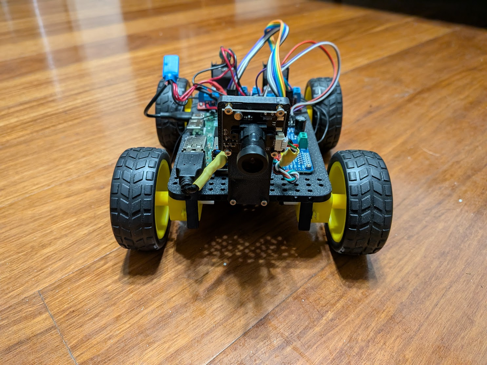

# GooseBot - Build, Drive, See, and Self-Drive



GooseBot is a four-wheel skid-steer educational robot built around a Radxa ROCK 5C Lite, four DC motors, a USB camera, a PCA9685 PWM controller, and a YOLO model running on the Rockchip NPU.

This repository is the technical source of truth for the GooseBot activities. Follow the linked READMEs here instead of switching between a separate instruction document and GitHub. Canvas may still specify due dates, points, group assignments, rubrics, and the place where evidence must be submitted.

## Start Here

1. Complete [Activity 00 - Laptop and repository setup](00_set_up/README.md).
2. Follow the **required student order** below. The directory numbers reflect the engineering topics, so the AI dataset and training activities (`07` and `08`) intentionally occur before model conversion (`05`) and NPU execution (`06`).
3. At the beginning of every work session, update your local repository safely:

   ```bash
   cd ~/goose
   git status --short
   git pull --rebase
   ```

   On Windows PowerShell, use the folder where you cloned the repository, for example `cd C:\goose`.

4. Do not use `git reset --hard`, Force, or any command that discards work to solve an update problem. Back up your edited files and ask the instructor if Git reports a conflict you cannot resolve.

## Required Student Roadmap

| Order | Activity | Mission | Completion evidence |
|---:|---|---|---|
| 0 | [Laptop and repository setup](00_set_up/README.md) | Install Python, VS Code, Git, and run a small Python program | version checks and working VS Code terminal |
| 1 | [Hardware selection](01_hardware_selection/README.md) | Identify every GooseBot subsystem and its engineering role | checked bill of materials and subsystem explanation |
| 2 | [Chassis assembly](02_chassis_design/README.md) | Install heat-set inserts, motors, wheels, and camera mount | assembled chassis inspection |
| 3 | [Mounting, wiring, and benchtop tests](03_mounting_and_wiring/README.md) | Wire the motors and safely verify direction and PWM speed control | four-motor PWM demonstration |
| 4 | [ROCK 5C motor control](04_motor_test/README.md) | Configure the SBC, map motor channels, and drive locally and over SSH | local bench test and remote driving video |
| 5 | [Create and label a dataset](07_dataset_creation/README.md) | Label GooseBot objects with bounding boxes and export YOLO data | labeled dataset and `data.yaml` |
| 6 | [Train and test the AI model](08_model_training/README.md) | Train YOLO and deploy the `.pt` model on a laptop webcam | notebook, metrics, and detection evidence |
| 7 | [Convert the model for the NPU](05_npu_conversion/README.md) | Convert the trained `.pt` weights to RKNN format | RKNN model folder and conversion log |
| 8 | [Run AI on the ROCK 5C](06_npu_execution/README.md) | Execute the RKNN model and stream detections to a browser | live NPU detection demonstration |
| 9 | [Autonomous lane following](09_self_driving/README.md) | Tune perception and PD steering, then complete a safe autonomous run | staged test evidence and self-driving video |

Optional advanced material is available in [10_goose_ros2](10_goose_ros2/README.md). It is not part of the required sequence above unless assigned by the instructor.

## Safety Rules That Apply to Every Hardware Activity

- Work with a partner whenever motors, a bench supply, soldering iron, DC-DC converter, or LiPo battery is involved.
- Remove power before changing wiring.
- Lift the chassis so all wheels are clear before the first run of any new motor-control code.
- Keep hair, fingers, wires, tools, and loose clothing away from wheels.
- Verify polarity and voltage with a multimeter before connecting the ROCK 5C. Its power input must be approximately 5 V, not the battery or motor voltage.
- Use a current-limited bench supply for initial tests. Do not parallel supply channels unless the exact instrument explicitly supports that operating mode and the instructor approves the configuration.
- Treat LiPo work as instructor-supervised. Stop immediately if a battery is swollen, hot, damaged, or has exposed conductors.
- Maintain a clear test area and a person ready to lift or disconnect the robot during floor tests.

## How Each Activity Is Organized

Every required activity contains:

- **Mission** - the engineering result to achieve;
- **Why It Matters** - how the work supports autonomous driving;
- **Success Criteria** - observable completion checks;
- **Prerequisites and Materials** - what must already be ready;
- **Guided Procedure** - numbered steps with safety gates;
- **Command Breakdown** - what important commands and options mean;
- **What to Submit** - the technical evidence normally requested; and
- **Troubleshooting** - checks to perform before asking for help.

If Canvas gives different submission requirements, Canvas controls grading and submission. GitHub controls the technical procedure.

## Repository Layout

```text
goose/
|-- 00_set_up/                  laptop tools and Git workflow
|-- 01_hardware_selection/      component choices and bill of materials
|-- 02_chassis_design/          CAD files and physical assembly
|-- 03_mounting_and_wiring/     wiring and benchtop electrical tests
|-- 04_motor_test/              motor mapping and keyboard control
|-- 05_npu_conversion/          PT-to-RKNN conversion on a development computer
|-- 06_npu_execution/           RKNN inference and browser streaming on ROCK 5C
|-- 07_dataset_creation/        images, labels, and YOLO dataset
|-- 08_model_training/          Colab/local YOLO training
|-- 09_self_driving/            lane following and stop-line behavior
|-- assets/                     repository-level media
`-- goose_ros2/                 optional ROS 2 integration
```

## Course and Network Information

Never place school Wi-Fi passwords, VPN credentials, private links, student information, or API keys in this public repository. Obtain current network credentials and course-specific access instructions directly from the instructor.

## Maintainers

Use relative links for repository files and images so forks remain functional. Put semester-independent technical instructions here; keep dates, point values, rubrics, and private course logistics in the learning-management system.
