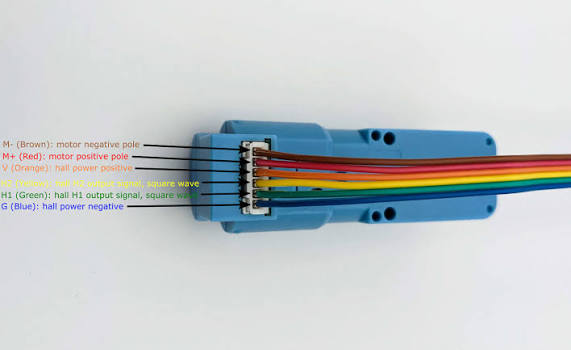

# GooseBot ROCK 5C Motor + Encoder Setup Guide

Complete beginner-friendly guide (hopefully) for installing and configuring:

- ROCK 5C SBC
- PCA9685 PWM motor controller
- Encoder DC motors
- Dual wheel encoder feedback
- Keyboard motor control
- Distance calculation

This setup is designed as the foundation for future:

- ROS2 Differential Drive
- Odometry
- Nav2 Navigation
- Autonomous Driving

---
NOTICE: Make sure to follow the instruction in 04_motor_test. You need to be able to enter goose, activate venv, the pythin virtual enviorment, and the proper libraries.

## Motor Wiring

The following picture shows the motor driver and encoder connections.

# 1. Hardware Overview

## Components

| Component | Purpose |
|---|---|
| ROCK 5C | Main computer |
| PCA9685 | PWM motor controller |
| Motor Driver | Controls motor power |
| TT Encoder Motors | Drive wheels + feedback |
| Battery | Motor power |
| Jumper wires | Connections |

---

# 2. System Architecture

             ROCK 5C

          I2C Communication
                |
                |
          PCA9685 PWM Board
                |
                |
         Motor Driver Board
                |
                |
          Encoder Motors


---

Encoder Signals:

Left Encoder ---> ROCK GPIO
Right Encoder ---> ROCK GPIO

# 3. Wiring

## PCA9685 → ROCK 5C

### I2C

| PCA9685 | ROCK 5C |
|-|-|
| SDA | Pin 3 |
| SCL | Pin 5 |
| GND | GND |
| VCC | 3.3V |

---

# 4. Motor Channel Mapping

Current working configuration:

| Motor | PCA9685 Channel |
|-|-|
| Front Left IN1 | CH0 |
| Front Left IN2 | CH1 |
| Rear Left IN1 | CH2 |
| Rear Left IN2 | CH3 |
| Rear Right IN1 | CH4 |
| Rear Right IN2 | CH5 |
| Front Right IN1 | CH6 |
| Front Right IN2 | CH7 |

---

# 5. Encoder Wiring

The encoder motor contains:

- VCC
- GND
- Channel A
- Channel B


## Left Encoder
Encoder A → ROCK Pin 11

Encoder B → ROCK Pin 13


GPIO:
PIN_15 and PIN_16


---

# 6. Encoder Direction

Because the left and right motors are mirrored, one encoder may count backwards.

The correct behavior is:

## Moving Forward
LEFT = Positive Counts
RIGHT = Positive Counts

## Moving Backward
LEFT = Negative Counts
RIGHT = Negative Counts

If one is in the wrong orientation switch the place of the Encoder A and B.


Do not change the software first.

---

# 7. Install Software

Update ROCK:

```bash
sudo apt update
sudo apt upgrade
```
Then install python tools:
```
sudo apt install python3-venv python3-pip
```

Follow the instruction on 04_motor test. The code as follows:
```
sudo apt-get update
sudo apt-get install python3-libgpiod

sudo apt install python3.11-venv
python3 -m venv venv --system-site-packages
source venv/bin/activate
pip install --upgrade pip
pip install adafruit-blinka
pip install adafruit-circuitpython-pca9685

git clone https://github.com/hoanbklucky/goose
ls
cd goose
```

# 9. Install Python Libraries

Make sure the virtual environment is activated:

```bash
cd ~/goose
source venv/bin/activate
```

Install the required Python packages:

## PCA9685 Motor Controller Library

```bash
pip install adafruit-circuitpython-pca9685
```

## GPIO Library

```bash
pip install gpiod
```

## CircuitPython Support

```bash
pip install adafruit-blinka
```

## Keyboard Control Support

```bash
pip install keyboard
```

Verify installation:

```bash
pip list
```

You should see:

```
adafruit-blinka
adafruit-circuitpython-pca9685
gpiod
keyboard
```

---

# 10. Test I2C Communication

The PCA9685 communicates with the ROCK 5C using I2C.

Check available I2C buses:

```bash
ls /dev/i2c*
```

Example:

```
/dev/i2c-7
```

Scan the I2C bus:

```bash
sudo i2cdetect -y 7
```

Expected result:

```
     0 1 2 3 4 5 6 7 8 9 a b c d e f
00:
10:
20:
30:
40: 40
50:
60:
70:
```

The PCA9685 default address is:

```
0x40
```

If `40` does not appear:

Check wiring:

| PCA9685 | ROCK 5C |
|---|---|
| SDA | Pin 3 |
| SCL | Pin 5 |
| VCC | 3.3V |
| GND | GND |

---

# 11. Verify Encoder GPIO Pins

Check the encoder GPIO mapping:

```bash
gpiofind PIN_11
gpiofind PIN_13
gpiofind PIN_15
gpiofind PIN_16
```

Expected:

Example:

```
gpiochip4 11
gpiochip4 10
gpiochip4 12
gpiochip1 5
```

Current encoder wiring:

## Left Encoder

```
Encoder A → ROCK Pin 11
Encoder B → ROCK Pin 13
```

## Right Encoder

```
Encoder A → ROCK Pin 15
Encoder B → ROCK Pin 16
```

---

# 12. Encoder Raw Signal Test

Before running the motor code, confirm the encoder produces signals.

Create:

```bash
nano encoder_raw_test.py
```

Paste:

```python
import time
import gpiod


# LEFT ENCODER
LEFT_A_CHIP = "/dev/gpiochip4"
LEFT_B_CHIP = "/dev/gpiochip4"

LEFT_A = 11
LEFT_B = 10


chipA = gpiod.Chip(LEFT_A_CHIP)
chipB = gpiod.Chip(LEFT_B_CHIP)


A = chipA.get_line(LEFT_A)
B = chipB.get_line(LEFT_B)


A.request(
    consumer="encoder_A",
    type=gpiod.LINE_REQ_DIR_IN
)

B.request(
    consumer="encoder_B",
    type=gpiod.LINE_REQ_DIR_IN
)


print("Rotate wheel slowly...")
print("A B")


try:
    while True:

        print(
            A.get_value(),
            B.get_value()
        )

        time.sleep(0.05)


except KeyboardInterrupt:
    print("Stopped")
```

Run:

```bash
python encoder_raw_test.py
```

Rotate the wheel slowly.

A working encoder should show changing values:

Example:

```
0 1
1 1
1 0
0 0
0 1
```

---

# 13. Dual Encoder Test

After each encoder works individually, test both together.

The expected result:

```
LEFT_A LEFT_B | RIGHT_A RIGHT_B

0      1      | 0       1
1      1      | 1       1
1      0      | 1       0
0      0      | 0       0
```

Both wheels should change while rotating.

---

# 14. Encoder Direction Calibration

Because the motors are mirrored, one side may count backwards.

Correct forward movement:

```
LEFT  +++++
RIGHT +++++
```

Correct reverse movement:

```
LEFT  -----
RIGHT -----
```

If one wheel is backwards:

Example:

```
LEFT  +1000
RIGHT -1000
```

Swap the encoder wires:

```
Encoder A ↔ Encoder B
```

Do not change software first.

---

# 15. Motor + Encoder Keyboard Control (Version 4 as of testing this)

This program combines:

- PCA9685 motor control
- Four-wheel drive control
- Left encoder feedback
- Right encoder feedback
- Distance calculation
- Keyboard control

---

## Create the Program

Navigate to the motor test folder:

```bash
cd ~/goose/04_motor_test
```

Create the file:

```bash
nano motor_encoder_keyboard_v4.py
```

Paste the complete motor encoder code into the file. (Linked in this folder)

Save:

```
CTRL + O
ENTER
```

Exit:

```
CTRL + X
```

---

## Run the Program

Activate the virtual environment:

```bash
cd ~/goose
source venv/bin/activate
```

Go back to the motor folder:

```bash
cd 04_motor_test
```

Run:

```bash
python motor_encoder_keyboard_v4.py
```

---

## Keyboard Controls

```
W  → Forward

S  → Reverse

A  → Turn Left

D  → Turn Right

X  → Exit
```

---

## Expected Output

When running:

```
Motors initialized
Encoders initialized

Ready for input

WASD to move
X to exit


Left:      0
Right:     0
Distance:  0.00 in
```

When moving forward:

Example:

```
Left:     500
Right:    520

Average:  510

Distance: 1.85 in
```

The left and right encoder counts should both increase.

---

## If Distance Goes Negative While Moving Forward

Example:

```
Left:  -500
Right:  520
```

The encoder direction is reversed.

Fix:

Swap the encoder signal wires:

```
Encoder A ↔ Encoder B
```

on the wheel that is counting backwards.

---

## Final Motor Test

Before continuing:

- [ ] Both motors move forward
- [ ] Both motors reverse
- [ ] Turning works
- [ ] Left encoder increases
- [ ] Right encoder increases
- [ ] Distance increases while moving forward
- [ ] Distance decreases while reversing

# 16. Distance Calculation

The robot distance is calculated using both wheel encoders.

Formula:

```
Average Encoder Count =
(Left Count + Right Count) / 2


Distance =
Average Count
/
Counts Per Revolution
*
Wheel Circumference
```

Example:

```
Left encoder:
1000 counts

Right encoder:
1100 counts


Average:

1050 counts
```

---

# 17. Troubleshooting

## Encoder always reads 0

Check:

1. Encoder power connection
2. Encoder ground connection
3. GPIO pin mapping
4. Motor connector seating

Check GPIO:

```bash
gpioinfo
```

---

## Encoder only reads one side

Check:

```
Encoder A
Encoder B
```

Verify both signal wires.

Test each encoder separately before combining.

---

## Encoder direction is reversed

Swap:

```
A ↔ B
```

Example:

Before:

```
A → Pin 11
B → Pin 13
```

After:

```
A → Pin 13
B → Pin 11
```

---

## Encoder works slowly but fails at full speed

Possible causes:

- Software polling speed
- Electrical noise
- Missing encoder transitions

Solutions:

- Reduce motor speed
- Add hardware filtering
- Use GPIO interrupts for final ROS2 implementation

---

## Motors work but keyboard does nothing

Make sure:

```bash
source venv/bin/activate
```

Then:

```bash
python motor_encoder_keyboard.py
```

---

## PCA9685 is not detected

Run:

```bash
sudo i2cdetect -y 7
```

Expected:

```
40
```

If missing:

Check:

```
SDA → ROCK Pin 3

SCL → ROCK Pin 5

GND → GND
```

---

# 18. Final Verification Checklist

Before moving to autonomous navigation:

- [ ] PCA9685 detected
- [ ] Motors move forward
- [ ] Motors reverse
- [ ] Turning works
- [ ] Left encoder reads
- [ ] Right encoder reads
- [ ] Both encoders count together
- [ ] Forward gives positive distance
- [ ] Reverse gives negative distance
- [ ] Encoder values remain stable

---

# Next Steps

After this system works:

1. Add wheel speed PID control
2. Add IMU sensor fusion
3. Publish encoder odometry
4. Integrate ROS2 `diff_drive_controller`
5. Use Nav2 autonomous navigation

